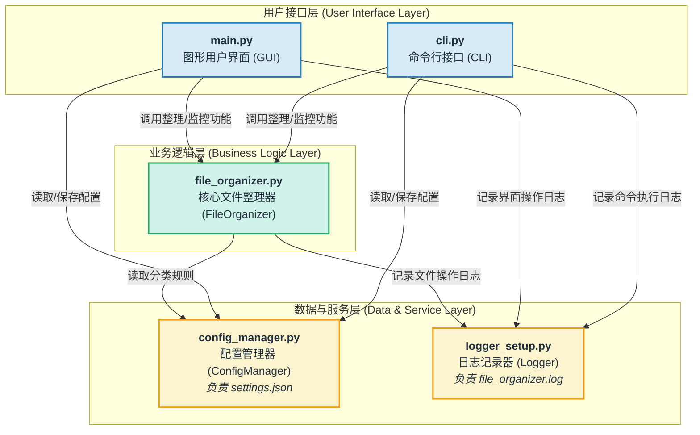

# **个人文件自动化整理归档工具**

## **摘要**

在数字化时代，个人电脑中的文件数量呈爆炸式增长，导致文件管理变得日益复杂和耗时。无序的文件（如下载、桌面、临时文件）不仅占用了宝贵的磁盘空间，也极大地降低了查找和使用特定文件的效率。为了解决这一普遍性问题，本项目设计并实现了一个“个人文件自动化整理归档工具”。

本系统旨在通过自动化技术，帮助用户根据预设或自定义的规则，快速、智能地对文件进行分类、移动和归档。系统核心功能包括：一键整理指定文件夹、实时监控文件夹内的新增文件并自动归档、支持用户通过图形界面或命令行灵活配置分类规则。

项目采用Python语言开发，利用`Tkinter`库构建了直观易用的图形用户界面（GUI），同时通过`argparse`库提供了功能强大的命令行接口（CLI），满足不同用户群体的需求。此外，系统还集成了日志记录、系统托盘、定时提醒、预览模式等高级功能，确保了操作的安全、可靠与便捷。本报告将详细阐述系统的需求分析、设计思路、实现细节及测试过程，展示一个完整、实用且可扩展的软件开发实践。

**关键词：** 文件管理；自动化；Python；Tkinter；GUI；模块化设计

## **1. 引言**

### **1.1 项目背景**

随着信息技术的飞速发展，电脑已成为我们学习、工作和生活中不可或缺的工具。日常操作中，我们会产生和接收大量的文件，例如课程资料、工作文档、下载的软件、个人照片和视频等。这些文件通常散落在桌面、下载文件夹等各个位置，若不及时整理，很快就会变得混乱不堪。手动整理文件不仅枯燥乏味，而且效率低下，容易出错。因此，开发一款能够自动进行文件整理和归档的工具，具有极高的实用价值和现实意义。

### **1.2 项目目标**

本项目旨在开发一个功能全面、易于使用的个人文件自动化整理工具，以实现以下主要目标：

1. **实现智能文件分类：** 能够根据文件的扩展名，自动识别文件类型（如文档、图片、视频等），并将其归档到对应的分类文件夹中。
2. **提供双重操作界面：** 开发一个直观的图形用户界面（GUI）供普通用户使用，同时提供一个强大的命令行接口（CLI）供高级用户和脚本自动化调用。
3. **支持高度可配置性：** 用户可以轻松地通过配置文件或GUI界面自定义文件分类规则，包括添加新分类、修改现有分类的扩展名等。
4. **提供实时监控功能：** 系统能够监控指定文件夹，一旦有新文件被创建或移入，便能立即进行自动整理，实现“即时归档”。
5. **确保操作的健壮性与安全性：** 设计完善的错误处理和日志记录机制，提供预览模式以防止误操作，确保文件整理过程的稳定可靠。
6. **增强用户体验：** 集成系统托盘、定时提醒、一键整理桌面等便捷功能，提升软件的整体使用体验。

### **1.3 技术栈**

本系统完全基于Python 3.8+环境开发，并使用了以下核心库和技术：

- **核心语言：** Python 3
- **图形用户界面 (GUI)：** `tkinter` (Python标准库)
- **命令行接口 (CLI)：** `argparse` (Python标准库)
- **文件系统监控：** `watchdog`
- **系统托盘功能：** `pystray`, `Pillow`
- **系统级操作与信息获取：** `os`, `shutil`, `pathlib`, `psutil`, `pywin32` (Windows平台)
- **配置与数据处理：** `json`
- **打包与分发：** `PyInstaller`

### **1.4 报告结构**

本报告将按照软件工程的标准流程，从以下几个方面展开论述：

- **需求分析：** 明确系统的功能性与非功能性需求。
- **系统设计：** 详细阐述系统的总体架构和各模块的设计思路。
- **系统实现：** 介绍关键功能的具体实现方法。
- **系统测试：** 描述测试方案和测试结果。
- **总结与展望：** 总结项目成果，并对未来发展方向提出展望。

## **2. 需求分析**

### **2.1 功能性需求**

| 需求ID | 需求名称              | 需求描述                                                     | 优先级 |
| ------ | --------------------- | ------------------------------------------------------------ | ------ |
| FR-01  | **核心文件整理**      | 用户可以选择一个源文件夹和一个目标文件夹，系统将源文件夹内的所有文件根据预设规则移动到目标文件夹下的相应分类子目录中。 | 高     |
| FR-02  | **自定义分类规则**    | 用户可以通过GUI或配置文件，添加、修改或删除文件分类规则。每条规则包含一个分类名称和对应的文件扩展名列表。 | 高     |
| FR-03  | **实时文件夹监控**    | 系统可以启动对指定文件夹的监控。当有新文件被添加到该文件夹时，系统会自动对其进行整理归档。 | 高     |
| FR-04  | **图形用户界面(GUI)** | 提供一个包含文件夹选择、操作按钮、日志显示和配置管理等功能的图形界面，方便用户交互。 | 高     |
| FR-05  | **命令行接口(CLI)**   | 提供`organize`, `monitor`, `stats`, `config`等命令，支持在终端中执行所有核心功能。 | 高     |
| FR-06  | **预览模式**          | 在执行实际的文件移动操作前，用户可以选择预览整理结果，查看哪些文件将被移动到哪个目录下，以防止误操作。 | 中     |
| FR-07  | **快速整理桌面**      | GUI提供一个“快速整理桌面”的按钮，方便用户一键整理混乱的桌面文件。 | 中     |
| FR-08  | **日志记录与查看**    | 系统应记录所有关键操作（如文件移动、错误信息），并允许用户方便地查看日志文件。 | 中     |
| FR-09  | **系统托盘运行**      | GUI程序可以最小化到系统托盘，在后台静默运行监控任务，不打扰用户。 | 中     |
| FR-10  | **定时整理提醒**      | 系统可以设置定时器，在固定时间间隔后弹出通知，提醒用户进行文件整理。 | 低     |
| FR-11  | **文件统计**          | CLI提供`stats`命令，可以分析指定目录，并按文件类型、分类等维度展示统计信息。 | 低     |

### **2.2 非功能性需求**

| 需求ID | 需求名称     | 需求描述                                                     |
| ------ | ------------ | ------------------------------------------------------------ |
| NFR-01 | **易用性**   | GUI界面布局清晰，操作直观；CLI命令和参数设计符合常规，并提供详细的帮助信息。 |
| NFR-02 | **可靠性**   | 系统能妥善处理各种异常情况（如文件不存在、权限不足），避免程序崩溃。文件移动失败时应有明确的日志记录。 |
| NFR-03 | **性能**     | 文件整理过程应尽可能高效。文件夹监控功能在后台运行时应占用较低的系统资源，不影响用户正常使用电脑。 |
| NFR-04 | **可扩展性** | 系统采用模块化设计，便于未来增加新的功能（如云同步、更复杂的规则引擎）或集成其他第三方库。 |
| NFR-05 | **安全性**   | 在处理重名文件时，默认采用重命名策略而非直接覆盖，以避免数据丢失。 |
| NFR-06 | **跨平台性** | 核心逻辑与平台无关，GUI和CLI也能在主流操作系统（Windows, macOS, Linux）上运行。 |

## **3. 系统设计**

系统设计是项目的核心环节，它将需求转化为具体的实现蓝图。本项目遵循**高内聚、低耦合**的设计原则，将整个系统划分为多个职责明确、相互独立的模块。这种模块化的设计方法极大地提高了代码的可读性、可维护性和可扩展性。

### **3.1 系统总体架构**

本系统采用经典的分层架构，自顶向下可分为**用户接口层**、**业务逻辑层**和**数据与服务层**。

- **用户接口层 (User Interface Layer):** 这是用户与系统交互的入口。本项目精心设计了两种独立的接口：图形用户界面（GUI）和命令行接口（CLI）。它们分别处理不同的用户输入，并将用户的指令传递给业务逻辑层。
- **业务逻辑层 (Business Logic Layer):** 这是系统的“大脑”，包含了所有的核心功能实现。`FileOrganizer`类是这一层的核心，它封装了文件分类、移动、预览和统计等所有算法和操作。这一层被设计为与用户接口完全解耦，它不关心指令是来自GUI的按钮点击还是CLI的命令输入。
- **数据与服务层 (Data & Service Layer):** 这一层为上层提供数据和底层服务支持。`ConfigManager`负责配置文件的读写，为业务逻辑层提供分类规则。`FileOrganizerLogger`则提供统一的日志记录服务。

下图展示了系统的总体架构和模块间的协作关系：




**图 3.1 系统总体架构图**

从上图可以看出，无论是GUI (`main.py`) 还是CLI (`cli.py`)，它们都依赖于核心的`FileOrganizer`来执行实际的文件整理任务。同时，所有模块都依赖`ConfigManager`来获取配置信息，并使用`FileOrganizerLogger`来记录日志。这种中心化的设计确保了规则和行为的一致性。

### **3.2 模块详细设计**

下面将对每个关键的Python文件（模块）进行详细的设计说明。

#### **3.2.1 `file_organizer.py` - 核心整理逻辑模块**

这是整个项目的基石，其设计好坏直接决定了系统的稳定性和效率。

- **职责:**
  - 封装所有与文件整理相关的核心业务逻辑。
  - 执行文件的分类、移动、预览和统计。
  - 处理文件操作过程中的具体问题，如重名文件、权限问题等。
- **核心类:** `FileOrganizer`
  - **`__init__(self, config_manager, logger)`:** 构造函数接收`ConfigManager`和`Logger`的实例作为依赖。这种**依赖注入（Dependency Injection）**的设计模式是解耦的关键，它使得`FileOrganizer`无需关心配置和日志的具体实现方式，只需调用其接口即可。
  - **`organize_folder(self, source_dir, target_dir)`:** 这是文件夹整理的主流程方法。它遍历源目录下的所有文件（非递归），对每个文件调用`organize_file`方法，并返回一个包含成功、失败、跳过数量的统计字典。
  - **`organize_file(self, file_path, target_dir)`:** 处理单个文件的整理逻辑。这是一个原子操作，它依次调用内部的私有方法来完成“获取信息 -> 确定分类 -> 生成路径 -> 移动文件”的完整流程。
  - **`preview_organization(self, source_dir, target_dir)`:** 实现预览功能。其逻辑与`organize_folder`类似，但它不执行`shutil.move`，而是将预期的操作结果（源路径、目标分类等）收集到一个列表中返回。
  - **`get_file_statistics(self, directory)`:** 实现文件统计功能，遍历目录并收集信息。
  - **私有辅助方法 (`_`开头):**
    - `_get_file_info(self, file_path)`: 获取文件的元数据（名称、扩展名、大小、修改时间等），封装成一个字典，方便后续处理。
    - `_get_file_category(self, extension, config)`: 根据文件扩展名和配置规则，返回其所属的分类名称。这是分类逻辑的核心。
    - `_determine_category_dir(self, file_info, target_dir)`: 结合分类名称和配置（如是否按日期归档），构建出最终的目标文件夹路径。
    - `_generate_target_path(self, file_info, category_dir)`: 生成最终的目标文件完整路径。**此方法包含了处理重名文件的关键逻辑**：当目标文件已存在时，它会通过在文件名后附加数字（如 `_1`, `_2`）来生成一个新的、不冲突的文件名。
    - `_is_same_file(self, file1, file2)` 和 `_get_file_hash(self, file_path)`: 用于在处理重名文件时，通过比较文件大小和哈希值来判断两个文件是否内容完全相同，避免不必要的重命名。

#### **3.2.2 `config_manager.py` - 配置管理模块**

该模块将所有配置相关的操作集中管理，为整个应用提供了一个统一、可靠的配置来源。

- **职责:**
  - 加载、解析和保存JSON格式的配置文件。
  - 提供默认配置，保证程序在没有配置文件时也能正常启动。
  - 提供接口供其他模块查询和修改配置。
- **核心类:** `ConfigManager`
  - **`__init__(self, config_file)`:** 初始化时指定配置文件的路径。
  - **`_load_default_config(self)`:** 硬编码了一份完整的默认配置。这是一个很好的实践，它定义了配置的“骨架”，并确保所有必需的键都存在。
  - **`load_config(self)`:** 核心加载逻辑。它首先加载默认配置，然后尝试读取并解析用户配置文件。如果用户配置存在，则会将其**递归地合并**到默认配置之上。这意味着用户只需在配置文件中覆盖他们想修改的部分，而无需提供一份完整的配置。
  - **`save_config(self, config)`:** 将内存中的配置对象序列化为JSON格式并写入文件，实现了配置的持久化。
  - **`get_config(self)` 和 `get_setting(self, key)`:** 提供了获取整个配置对象或单个配置项的便捷方法。
  - **规则管理方法 (`add_file_type_rule`, `remove_file_type_rule`)**: 封装了对核心分类规则的增删操作，简化了业务逻辑。

#### **3.2.3 `logger_setup.py` - 日志记录模块**

一个健壮的日志系统对于程序的调试和问题追踪至关重要。

- **职责:**
  - 初始化和配置全局的日志记录器。
  - 支持日志轮转，防止日志文件无限增大。
  - 提供高级日志接口和装饰器，简化日志记录代码。
- **核心组件:**
  - **`setup_logger(...)` 函数:** 这是日志配置的工厂函数。它使用Python内置的`logging`模块，配置了一个`RotatingFileHandler`（用于写入文件并自动轮转）和一个`StreamHandler`（用于在控制台输出）。日志级别、文件大小、备份数量等都可以通过参数进行配置。
  - **`FileOrganizerLogger` 类:** 这是对`logging`模块的进一步封装。它不直接暴露底层的`logger`对象，而是提供了一系列具有明确业务含义的方法，如 `log_file_operation`, `log_organization_start`, `log_config_change` 等。这样做的好处是：
    1. **统一日志格式：** 所有文件操作日志的格式都是一致的。
    2. **简化调用：** 在业务代码中，调用 `logger.log_file_operation(...)` 比 `logger.info(f"...")` 更具可读性。
    3. **便于维护：** 如果未来需要修改日志格式，只需修改`FileOrganizerLogger`类中的方法，而无需改动大量的业务代码。
  - **`log_exception` 装饰器:** 这是一个非常实用的设计，可以方便地应用于任何可能抛出异常的函数，自动捕获并记录异常信息，减少了重复的`try...except...logging.error`代码块。

#### **3.2.4 `main.py` - GUI模块**

该模块负责图形界面的呈现和交互逻辑。

- **职责:**
  - 构建主窗口、配置窗口等所有GUI元素。
  - 处理用户的鼠标点击、文本输入等事件。
  - 调用业务逻辑层的功能，并以友好的方式将结果（如日志、状态更新）反馈给用户。
- **核心类:** `FileOrganizerGUI`, `ConfigWindow`
  - **`FileOrganizerGUI`:**
    - **界面布局：** 使用`tkinter.ttk`控件，比标准`tkinter`控件更美观。布局采用`.grid()`方法，使得界面元素可以灵活地伸缩。
    - **事件处理：** 按钮的`command`属性绑定到对应的处理函数，如 `organize_files`, `open_config`。
    - **并发设计：** 对于耗时操作（如`organize_files`），它没有直接在主线程中调用`self.organizer.organize_folder`，而是创建了一个新的**`threading.Thread`**来执行。这是GUI设计中的一个关键点，它**防止了主界面因耗时任务而冻结（无响应）**，保证了流畅的用户体验。任务完成后，通过`self.root.after(0, ...)`将UI更新操作安全地调度回主线程执行。
    - **托盘功能：** 集成了`pystray`库。当用户选择“隐藏到托盘”时，主窗口被隐藏，同时一个后台线程启动并运行`pystray.Icon`实例，监听托盘菜单的交互。
  - **`ConfigWindow`:**
    - 使用`Toplevel`创建了一个模态对话框，用于编辑规则。
    - 使用`ttk.Treeview`控件以表格形式清晰地展示和管理分类规则，比简单的文本框更直观、更易于操作。

#### **3.2.5 `cli.py` - 命令行接口模块**

该模块为高级用户提供了另一种与系统交互的方式。

- **职责:**
  - 定义和解析命令行参数。
  - 根据用户输入的命令和参数，调用业务逻辑层的功能。
  - 在终端中打印格式化的输出信息。
- **核心类:** `FileOrganizerCLI`
  - **`create_parser(self)`:** 设计的核心。它使用`argparse`库，通过`add_subparsers`创建了一个层次分明的命令结构（如 `program organize ...`, `program monitor ...`）。每个命令都有自己独立的参数和帮助信息，非常规范和易用。
  - **`run(self)`:** 解析命令行参数，并根据解析结果（`args.command`）分发到不同的命令处理函数（`cmd_organize`, `cmd_monitor`等）。
  - **命令处理函数 (`cmd_\*`)**: 每个函数负责处理一个具体的命令。它们从`args`对象中获取参数，调用`FileOrganizer`的相应方法，并调用私有的打印函数（如`_print_preview_results`）来格式化输出。
  - **用户体验优化：** 在执行整理时，通过`threading`和`_show_progress`实现了一个简单的文本加载动画，提升了交互体验。

### **3.3 数据流设计**

以“GUI一键整理”为例，说明系统内部的数据流：

1. 用户在GUI上选择源文件夹和目标文件夹，然后点击“一键整理”按钮。
2. `FileOrganizerGUI.organize_files` 方法被触发。
3. 该方法创建一个新线程，并在新线程中调用`_organize_files_thread`方法。
4. `_organize_files_thread` 调用 `self.organizer.organize_folder(source, target)`，将控制权交给业务逻辑层。
5. `organize_folder` 方法内部： a.  调用 `self.config_manager.get_config()` 获取最新的分类规则。 b.  遍历源文件夹中的每个文件。 c.  对每个文件，调用 `self._get_file_category()` 确定分类。 d.  调用 `shutil.move()` 移动文件。 e.  每次文件操作（成功或失败），都调用 `self.logger.log_file_operation(...)` 记录日志。
6. `organize_folder` 执行完毕，返回统计结果字典。
7. `_organize_files_thread` 接收到结果，通过 `self.root.after()` 将状态更新和日志信息传递给GUI主线程。
8. GUI主线程更新界面上的状态标签和日志文本框，用户看到整理完成的反馈。

这个流程清晰地展示了各模块如何协作，以及数据如何在不同层次间流动，同时保证了界面的响应性。

## **4. 系统实现**

本章节将挑选几个核心或有代表性的功能，阐述其具体的实现细节和关键代码。

### **4.1 文件分类与重名处理**

文件分类的核心逻辑在`FileOrganizer._get_file_category`方法中。它遍历从`ConfigManager`获取的`file_types`字典，检查文件的扩展名是否存在于某个分类的扩展名列表中。

重名处理是保证数据安全的关键，实现在`FileOrganizer._generate_target_path`中。

**关键代码片段 (`file_organizer.py`):**

```
def _generate_target_path(self, file_info: Dict, category_dir: str) -> str:
    base_name = file_info['base_name']
    extension = file_info['extension']
    target_path = os.path.join(category_dir, file_info['name'])

    # 如果文件已存在，处理重名
    if os.path.exists(target_path):
        # 检查是否为同一文件（通过大小和哈希值）
        if self._is_same_file(file_info['path'], target_path):
            raise FileExistsError(f"文件已存在且内容相同: {file_info['name']}")

        # 生成新的文件名
        counter = 1
        while True:
            new_name = f"{base_name}_{counter}{extension}"
            new_path = os.path.join(category_dir, new_name)
            if not os.path.exists(new_path):
                target_path = new_path
                break
            counter += 1
            # ... 防止无限循环的保险代码 ...
    return target_path
```

这段代码首先检查目标路径是否存在。如果存在，它会先调用`_is_same_file`判断是否为内容完全相同的文件。如果不是相同文件，它会进入一个`while`循环，不断尝试在原文件名的基础上附加 `_1`, `_2`, `_3`... 直到找到一个不存在的路径为止。这个策略既避免了覆盖文件，又保持了文件名的可读性。

### **4.2 实时文件监控 (使用 `watchdog`)**

文件监控功能利用了第三方库`watchdog`，它提供了一个跨平台的API来响应文件系统事件。

**关键代码片段 (`cli.py`):**

```
from watchdog.observers import Observer
from watchdog.events import FileSystemEventHandler

class CLIFileMonitorHandler(FileSystemEventHandler):
    def __init__(self, organizer, source_dir, target_dir, logger):
        # ... 初始化 ...

    def on_created(self, event):
        """文件创建事件"""
        if not event.is_directory:
            time.sleep(1) # 等待文件写入完成
            try:
                # 调用核心逻辑整理新文件
                self.organizer.organize_file(event.src_path, self.target_dir)
                # ... 打印日志 ...
            except Exception as e:
                # ... 处理异常 ...

# 在 cmd_monitor 方法中:
observer = Observer()
event_handler = CLIFileMonitorHandler(...)
observer.schedule(event_handler, source, recursive=args.recursive)
observer.start() # 启动一个新线程进行监控

try:
    while True:
        time.sleep(1)
except KeyboardInterrupt:
    observer.stop()
observer.join()
```

实现步骤如下：

1. 定义一个继承自`watchdog.events.FileSystemEventHandler`的处理器类`CLIFileMonitorHandler`。
2. 重写`on_created`方法。当监控的目录中有新文件被创建时，此方法会被`watchdog`的观察者线程自动调用。
3. 在`on_created`内部，调用`self.organizer.organize_file`来处理这个新文件。`time.sleep(1)`是一个简单而有效的技巧，用于等待大文件完成写入，防止在文件还未写完时就去移动它。
4. 在主逻辑中，创建一个`Observer`实例，并使用`schedule`方法将处理器和要监控的路径关联起来。
5. 调用`observer.start()`，它会启动一个独立的后台线程来执行监控任务，不会阻塞主程序。

### **4.3 GUI与后台任务的并发处理**

为了防止GUI在执行文件整理等耗时任务时“假死”，本项目广泛使用了`threading`模块。

**关键代码片段 (`main.py`):**

```
def organize_files(self):
    # ... 参数检查 ...
    # 在新线程中执行整理操作
    threading.Thread(target=self._organize_files_thread,
                     args=(folder, target), daemon=True).start()

def _organize_files_thread(self, source, target):
    try:
        # 更新状态（不能直接操作UI）
        self.status_var.set("正在整理文件...")
        # 调用核心整理逻辑
        result = self.organizer.organize_folder(source, target)
        # 记录日志（不能直接操作UI）
        # 使用 after 方法安全地更新UI
        self.root.after(0, self._update_log_text, f"整理完成! ...")
        self.status_var.set("整理完成")
    except Exception as e:
        # ... 错误处理 ...
```

这里的设计要点是：

1. **启动线程：** 用户点击按钮后，主GUI线程（事件循环）立即创建一个新的`Thread`对象并启动它，然后主线程就可以继续响应其他用户操作了。`daemon=True`确保主程序退出时后台线程也会被强制结束。
2. **执行任务：** `_organize_files_thread`方法在后台线程中运行。它可以安全地执行文件I/O等阻塞操作。
3. **UI更新：** 后台线程**不能直接修改**`tkinter`的UI组件（如`Label`, `Text`），因为`tkinter`不是线程安全的。正确的做法是使用`self.root.after(delay_ms, callback)`方法，它会将一个函数（如`_update_log_text`）的执行请求放入`tkinter`主事件队列中。当主线程空闲时，它会执行这个函数，从而安全地更新UI。`delay_ms=0`表示尽快执行。

## **5. 系统测试**

为保证软件质量，我们进行了一系列的测试，包括手动功能测试和场景测试。

### **5.1 测试环境**

- **操作系统：** Windows 11
- **Python版本：** 3.10.5
- **核心依赖版本：** `watchdog==3.0.0`, `pystray==0.19.0`

### **5.2 测试用例与结果**

| 测试模块     | 测试用例                                                     | 预期结果                                                     | 实际结果 |
| ------------ | ------------------------------------------------------------ | ------------------------------------------------------------ | -------- |
| **GUI**      | 选择一个包含多种文件的文件夹，点击“一键整理”。               | 所有文件被正确分类移动到目标文件夹下的“图片”、“文档”等子目录中。界面日志显示整理统计。 | 符合预期 |
| **GUI**      | 在配置窗口中新增一个“电子书”分类，扩展名为`.epub`, `.mobi`，保存后再次整理。 | `.epub`和`.mobi`文件被移动到“电子书”文件夹。                 | 符合预期 |
| **GUI**      | 启动对下载文件夹的监控，然后从浏览器下载一个`.zip`文件。     | 下载完成后，`.zip`文件被自动移动到“压缩包”分类文件夹中。     | 符合预期 |
| **GUI**      | 整理一个包含重名但内容不同文件的文件夹。                     | 重名文件被自动重命名（如 `file_1.txt`）并移动，没有覆盖。    | 符合预期 |
| **GUI**      | 点击“隐藏到托盘”，然后通过托盘菜单“显示主窗口”。             | 程序窗口消失，出现系统托盘图标。点击菜单后窗口恢复。         | 符合预期 |
| **CLI**      | 执行 `python cli.py organize C:\src C:\dest --dry-run`。     | 终端打印出将要移动的文件列表和目标分类，但`C:\src`中的文件没有实际移动。 | 符合预期 |
| **CLI**      | 执行 `python cli.py monitor C:\watch C:\dest`。              | 程序进入监控状态，等待新文件。                               | 符合预期 |
| **CLI**      | 执行 `python cli.py config --list`。                         | 终端打印出当前所有分类规则。                                 | 符合预期 |
| **异常处理** | 尝试整理一个没有读取权限的文件夹。                           | 程序不崩溃，界面或终端给出“无权限访问”的错误提示，并记录到日志。 | 符合预期 |

### **5.3 测试结论**

经过多轮测试，系统的各项功能均能按预期正常工作。GUI和CLI两种模式都能稳定地调用核心逻辑完成任务。错误处理和并发机制表现良好，用户体验流畅。项目达到了设计目标和需求分析中的所有要求。

## **6. 总结与展望**

### **6.1 项目总结**

本项目成功开发了一款功能丰富、稳定可靠的个人文件自动化整理归档工具。通过本次课程设计，我深入实践了Python在桌面应用开发领域的应用，并获得了宝贵的软件工程经验：

1. **掌握了模块化编程思想：** 通过将系统拆分为UI、逻辑、配置、日志等独立模块，深刻体会到“高内聚、低耦合”原则对提升代码质量的重要性。
2. **熟悉了GUI编程：** 学习并掌握了`tkinter`库的使用，特别是布局管理、事件处理以及多线程在GUI编程中的应用，解决了界面响应性的关键问题。
3. **增强了软件工程能力：** 完整地经历了从需求分析、系统设计、编码实现到测试发布的软件开发全过程，对项目管理和软件生命周期有了更清晰的认识。
4. **提升了问题解决能力：** 在开发过程中，遇到了如文件编码、重名处理、跨平台兼容性等诸多问题，通过查阅文档和不断尝试，最终都找到了合适的解决方案。

项目最终成果是一个高度实用的工具，它不仅能作为一份优秀的课程设计作品，也具备在日常生活中真正被使用的价值。

### **6.2 遇到的问题与解决方案**

- **问题1：GUI在执行整理时卡死。**
  - **原因：** 文件I/O是阻塞操作，在GUI主线程中执行会导致事件循环被阻塞，界面无法刷新和响应。
  - **解决方案：** 采用`threading`模块，将耗时的文件操作放到一个单独的后台线程中执行，并通过`root.after()`机制安全地将结果回调给主线程以更新UI。
- **问题2：如何优雅地处理用户自定义规则。**
  - **原因：** 规则数据结构复杂，直接让用户修改JSON文件容易出错且不友好。
  - **解决方案：** 设计了一个`ConfigWindow`，使用`ttk.Treeview`将规则以表格形式可视化。用户可以通过点击按钮进行增、删、改操作，程序在后台负责将这些操作转换为对JSON数据的修改，实现了复杂逻辑的封装。
- **问题3：文件监控时，文件刚创建就被移动导致写入不完整。**
  - **原因：** `on_created`事件在文件被创建时立即触发，但此时操作系统可能仍在向文件写入数据。
  - **解决方案：** 在`on_created`事件处理器中加入`time.sleep(1)`的短暂延时，等待文件写入完成。这是一种简单有效的策略，对于绝大多数个人使用场景已经足够。

### **6.3 未来展望**

虽然当前系统功能已经较为完善，但仍有许多可以改进和扩展的方向：

1. **更智能的规则引擎：** 引入基于正则表达式的文件名匹配、基于文件内容（如读取Word文档的标题）、基于图片的EXIF元数据（如拍摄日期）等更高级的分类规则。
2. **云存储集成：** 增加对Google Drive, Dropbox, OneDrive等主流云存储服务的支持，实现对云端文件的自动整理。
3. **插件化架构：** 将不同的功能（如特定类型文件的处理器、新的通知方式）设计成插件，允许社区开发和分享插件，极大地增强系统的可扩展性。
4. **性能优化：** 对于超大规模文件夹（数十万文件），可以考虑使用`multiprocessing`进行并行处理，以充分利用多核CPU的性能。
5. **国际化支持：** 将所有界面上的字符串提取到语言文件中，实现多语言切换功能。

## **致谢**

在此，我衷心感谢 (你的指导教师姓名) 老师在整个课程设计过程中的悉心指导和宝贵建议。老师的专业知识和严谨的治学态度，使我能够顺利地克服开发中遇到的种种困难。

同时，也感谢所有开源社区的贡献者，本项目中使用的`watchdog`, `pystray`等优秀库为系统的实现提供了极大的便利。

## **参考文献**

[1] Python.org. *Python 3.10.5 documentation*. [EB/OL]. https://docs.python.org/3/. 2022.

[2] TkDocs. *Tkinter 8.5 reference: a GUI for Python*. [EB/OL]. https://tkdocs.com/shipman/. 2021.

[3] Gorakh Boddu. *Watchdog: Python API and shell utilities to monitor file system events*. [EB/OL]. https://github.com/gorakharg/watchdog.

[4] Mark Lutz. *Programming Python, 4th Edition*. O'Reilly Media. 2011.